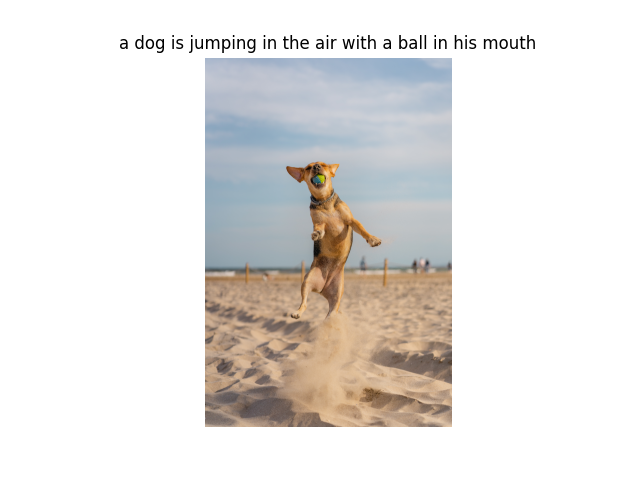
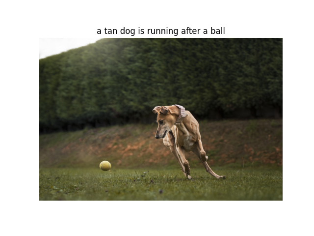
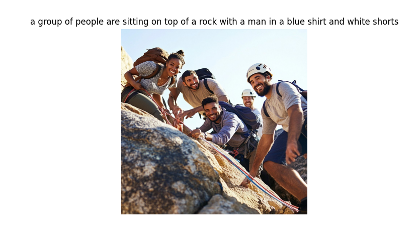

# 🖼️ MoE Image Captioning using Sparse Transformer Experts

> **A PyTorch implementation of an Image Captioning system based on an Encoder–Decoder architecture with a Mixture of Experts (MoE) Transformer Decoder and Noisy Routing.**


---

# 📖 Overview

This project implements an end-to-end Image Captioning system that combines a CNN-based visual encoder with a custom Transformer decoder enhanced by a **Mixture of Experts (MoE)** architecture. Instead of relying on a single feed-forward network, the decoder dynamically routes tokens through specialized experts using a **Noisy Router**, increasing model capacity while keeping computation efficient.

The project includes a complete training pipeline, evaluation utilities, TensorBoard integration, and a Streamlit web application for interactive inference.

---

# Demo 

[demo](assets/demo.png)

---
# ✨ Features

- 🧠 Custom Mixture of Experts Transformer Decoder
- 🚦 Noisy Top-k Expert Routing
- ⚖️ Diversity / Load Balancing Loss
- 📈 BLEU-1 & BLEU-4 Evaluation
- 📊 TensorBoard Logging
- 🖼️ Interactive Streamlit Demo
- ⚡ End-to-End PyTorch Training Pipeline

---

# 🏗️ Architecture

```text
Image
  │
  ▼
CNN Feature Encoder
  │
  ▼
Visual Embeddings
  │
  ▼
Mixture of Experts Transformer Decoder
 ├── Expert 1
 ├── Expert 2
 ├── Expert 3
 └── Noisy Router
  │
  ▼
Generated Caption
```

---

# 📊 Model Configuration

| Parameter | Value |
|------------|------:|
| Trainable Parameters | 186,897,811 |
| Embedding Dimension | 712 |
| Hidden Dimension | 712 |
| Attention Heads | 8 |
| Decoder Layers | 4 |
| Experts | 3 |
| Dropout | 0.2 |
| Optimizer | AdamW |
| Learning Rate | 1e-4 |
| Weight Decay | 1e-3 |
| Scheduler | CosineAnnealingLR |

---

# 📈 Results

| Metric | Score |
|---------|------:|
| BLEU-1 | **0.753** |
| BLEU-4 | **0.397** |

Evaluation is performed using corpus BLEU with smoothing on the held-out test set.

---

# 📂 Repository Structure

```text
.
├── assets/
├── checkpoints/
├── Data/
├── Logs/
├── test_images/
├── model/
│   ├── components/
│   ├── dataset.py
│   ├── evaluation.py
│   ├── generation.py
│   ├── model.py
│   ├── moe_transformer.py
│   └── trainer.py
├── app.py
├── train.py
├── test.py
└── README.md
```

---

# 📸 Sample Outputs


### Example 1


--

### Example 2


--

### Example 3



---

# 🚀 Installation

```bash
git clone https://github.com/ziadTeama-dev/moe-image-captioning.git
cd MoE-Image-Captioning
pip install -r requirements.txt
```

Or install manually:

```bash
pip install torch torchvision streamlit pillow tensorboard
```

---

# 🏋️ Training

```bash
python train.py
```

Monitor training:

```bash
tensorboard --logdir Logs/
```

Tracked metrics:
- Training Loss
- Validation Loss
- Learning Rate
- BLEU-1
- BLEU-4

---

# 🧪 Evaluation

```bash
python test.py
```

---

# 🌐 Streamlit Demo

```bash
streamlit run app.py
```

Upload an image and generate captions interactively.

---

# 📌 Future Improvements

- Train on larger datasets (MS COCO)
- Beam Search decoding
- CIDEr, METEOR and SPICE evaluation
- DINOv2 encoder
- Flash Attention
- Mixed Precision Training
- Quantization

---

# 🛠️ Tech Stack

- Python
- PyTorch
- Torchvision
- Streamlit
- TensorBoard
- Pillow

---

# 📜 License

This project is released under the MIT License.

---

# 🙌 Acknowledgments

Built to explore modern Vision-Language Models, Transformers, and Sparse Mixture of Experts architectures for Image Captioning.

---

#  👨🏻‍💻 Aurhor

- **Ziad Abdel-Haliem Teama** 
