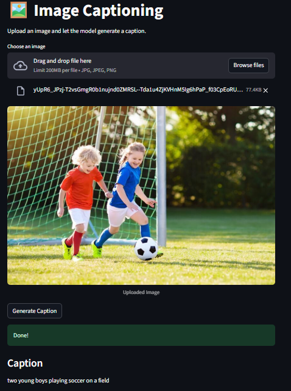
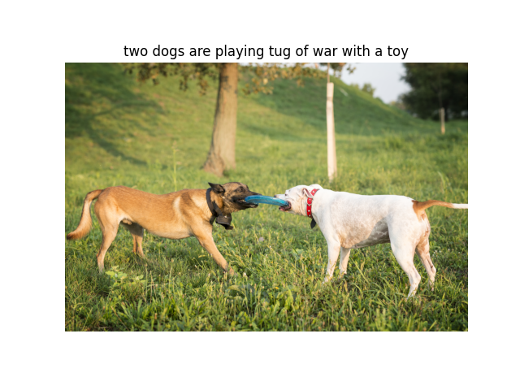

# 🖼️ MOE Image Captioning

A custom **Image Captioning** system built with **PyTorch**, combining a pretrained **ResNet-50 image encoder** with a custom **Mixture of Experts (MOE) Transformer decoder**.

The project focuses on dynamic computation through **confidence-based early exit**, aiming to reduce inference time while maintaining caption quality.

> **All reported experiments in this README were performed using a model trained for only 10 epochs.**

---

## 🚀 Project Overview

The model follows this pipeline:

```text
Image
  │
  ▼
ResNet-50
  │
  ▼
49 Visual Tokens
  │
  ▼
Visual Positional Embeddings
  │
  ▼
MOE Transformer Decoder
  │
  ├── Self-Attention
  ├── Cross-Attention
  ├── Noisy Router
  ├── Top-1 Expert Routing
  ├── Shared Expert
  └── Confidence-Based Early Exit
  │
  ▼
Generated Caption
```

The main components are:

* 🖼️ ResNet-50 visual encoder
* 🧠 Custom Multi-Head Attention
* 🔀 Mixture of Experts
* 🎯 Noisy Router
* 🔗 Cross-Attention
* 🚪 Confidence-Based Early Exit
* 📊 BLEU-1 / BLEU-4 evaluation
* 🌐 Streamlit inference application

---

# 🧠 Model Architecture

## Image Encoder

The image encoder uses a pretrained **ResNet-50** model trained on ImageNet.

The classification head and average pooling are removed so that spatial information is preserved.

The resulting feature map is:

```text
2048 × 7 × 7
```

which is converted into:

```text
49 × 2048
```

Therefore, each image is represented using **49 visual tokens**.

These features are projected into the model embedding space and combined with learned positional embeddings.

---

# 🤖 MOE Transformer Decoder

The decoder consists of **4 Transformer layers**.

Each layer contains:

```text
RMSNorm
   │
   ▼
Self Multi-Head Attention
   │
   ▼
Residual Connection
   │
   ▼
Cross Attention
   │
   ▼
Residual Connection
   │
   ▼
RMSNorm
   │
   ▼
Noisy Router
   │
   ├──────────┬──────────┐
   ▼          ▼          ▼
Expert 1   Expert 2   Expert 3
   │          │          │
   └──────────┴──────────┘
              │
              +
        Shared Expert
              │
              ▼
       Residual Connection
```

The model uses **3 experts** and **Top-1 routing**, meaning each token is routed to the expert with the highest router probability.

A shared expert also processes every token.

---

# 🔀 Noisy Expert Routing

The router predicts which expert is most suitable for each token.

During training, Gaussian noise is added to the router logits using a learned noise scale:

```text
Router Logits
      +
Learned Noise × Gaussian Noise
      │
      ▼
    Softmax
      │
      ▼
Expert Probabilities
```

The highest-probability expert is selected.

A diversity loss is also used to encourage better expert utilization.

---

# 👀 Confidence-Based Early Exit

One of the main ideas explored in this project is **early exit**.

Normally, every generated token goes through all 4 decoder layers:

```text
Layer 0
   ↓
Layer 1
   ↓
Layer 2
   ↓
Layer 3
   ↓
Prediction
```

With confidence-based early exit:

```text
Layer 0
   │
   ├── Prediction
   └── Confidence
         │
         ├── High → EXIT
         │
         └── Low
              ↓
            Layer 1
              │
              └── ...
```

Each decoder layer has:

1. An early classification head.
2. A confidence head.

If the confidence is higher than the selected threshold, the model exits early and predicts the next token without processing the remaining layers.

---

# 🧪 Experiments

The model was trained for **10 epochs**.

Two inference configurations were evaluated:

* `confidence = 1.0`
* `confidence = 0.5`

The evaluation was performed on **1,012 unique test images**.

---

## Experiment 1 — Confidence = 1.0

With a confidence threshold of `1.0`, the model effectively uses the complete decoder depth.

### Results

```text
BLEU-1 = 0.616356
BLEU-4 = 0.211024

Evaluation Time = 7.08 minutes
Images = 1012
Epochs = 10
```

Example prediction:

```text
a man in a red shirt is climbing a rock while another man
in a white shirt watches
```

Reference captions included descriptions such as a man climbing a rock in a red/pink shirt.

---

## Experiment 2 — Confidence = 0.5

The confidence threshold was reduced to `0.5`, allowing the model to exit earlier whenever it was sufficiently confident.

### Results

```text
BLEU-1 = 0.629993
BLEU-4 = 0.219419

Evaluation Time = 5.43 minutes
Images = 1012
Epochs = 10
```

Example prediction:

```text
a man in a red shirt is climbing a rock
```

---

# 📊 Results Comparison

| Configuration    |     BLEU-1 |     BLEU-4 | Evaluation Time |
| ---------------- | ---------: | ---------: | --------------: |
| Confidence = 1.0 |     0.6164 |     0.2110 |        7.08 min |
| Confidence = 0.5 | **0.6300** | **0.2194** |    **5.43 min** |

The `0.5` confidence experiment reduced evaluation time from:

```text
7.08 min → 5.43 min
```

which is approximately a **23% reduction in evaluation time**.

At the same time, the measured BLEU scores did **not decrease**:

```text
BLEU-1
0.6164 → 0.6300

BLEU-4
0.2110 → 0.2194
```

In this experiment, the early-exit configuration actually produced a small improvement in the measured BLEU scores.

> The important observation is that early exit reduced evaluation time without causing a degradation in BLEU on this experiment. The BLEU improvement should not be interpreted as proof that early exit inherently improves model quality.

---

# 📸 Demo



---

# 📸 Sample Outputs

## Example 1


## Example 2


## Example 3


## Example 4



---

# 📈 Evaluation Results

The project evaluates the generated captions using:

* **BLEU-1**
* **BLEU-4**

For each image, all available reference captions are compared against the generated caption.

The evaluation also makes sure that an image is not evaluated multiple times even though Flickr8k contains multiple captions for each image.

---

# 📚 Dataset

The project uses the **Flickr8k** dataset.

Each image contains multiple human-written captions.

The dataset is split at the **image level** to prevent captions belonging to the same image from appearing in both training and testing sets.

```text
Dataset: Flickr8k
Test Split: 12.5%
Random State: 42
```

The reported evaluation contains:

```text
1012 unique images
```

---

# 📝 Caption Processing

Captions are cleaned before being passed to the model.

The preprocessing includes:

* Lowercasing
* Removing punctuation
* Removing digits
* Removing non-alphabetic characters
* Removing extra spaces

The vocabulary contains:

```text
<PAD>
<SOS>
<EOS>
<UNK>
```

Tokenization is performed using **spaCy**.

---

# 🖼️ Data Augmentation

The training images use:

* Resize
* Random Crop
* Random Horizontal Flip
* Random Rotation
* Random Perspective
* Color Jitter
* ImageNet normalization

Pipeline:

```text
Resize
  ↓
Random Crop
  ↓
Random Horizontal Flip
  ↓
Random Rotation
  ↓
Random Perspective
  ↓
Color Jitter
  ↓
ToTensor
  ↓
ImageNet Normalization
```

---

# 🧪 Training Configuration

The reported experiments use the following model configuration:

| Parameter              |            Value |
| ---------------------- | ---------------: |
| Embedding Size         |              712 |
| Hidden Size            |              712 |
| Attention Heads        |                8 |
| Head Dimension         |              712 |
| Transformer Layers     |                4 |
| Number of Experts      |                3 |
| Expert Expansion Scale |                2 |
| Dropout                |              0.2 |
| Epochs                 |           **10** |
| Optimizer              |            AdamW |
| Learning Rate          |           `1e-4` |
| Weight Decay           |           `1e-3` |
| LR Scheduler           | Cosine Annealing |

--

### Hardware
Training and evaluation were performed on an NVIDIA Quadro P2000.

---

# 📊 Training Monitoring

Training metrics are logged using TensorBoard.

Tracked metrics include:

```text
Loss
Diversity Loss
Gradient Norm
Learning Rate
Average Loss
Confidence Loss
Early-Exit Cross Entropy
BLEU-1
BLEU-4
```

Run TensorBoard using:

```bash
tensorboard --logdir Logs
```

---

# 💾 Checkpoints

Model checkpoints are saved inside:

```text
checkpoints/
```

Example:

```text
checkpoints/
├── checkpoint_0.pth
├── checkpoint_1.pth
├── ...
└── checkpoint_9.pth
```

The Streamlit application loads:

```text
checkpoints/checkpoint_9.pth
```

---

# 🌐 Streamlit Application

The project includes a simple Streamlit interface.

Run:

```bash
streamlit run app.py
```

Then:

1. Upload an image.
2. Click **Generate Caption**.
3. The model generates the caption.
4. The generated caption is displayed.

---

# ⚙️ Installation

Clone the repository:

```bash
git clone https://github.com/ziadTeama-dev/moe-image-captioning.git
cd moe-image-captioning
```

Install dependencies:

```bash
pip install -r requirements.txt
```

Install the spaCy English model:

```bash
python -m spacy download en_core_web_sm
```

---

# 🏋️ Training

Run:

```bash
python train.py
```

The training configuration uses:

```text
Epochs = 10
Learning Rate = 1e-4
Optimizer = AdamW
Scheduler = CosineAnnealingLR
```

---

# 📁 Project Structure

```text
.
├── assets/
│   ├── demo.png
│   ├── evaluation.png
│   ├── Figure_1.png
│   ├── Figure_2.png
│   ├── Figure_3.png
│   └── Figure_4.png
│
├── checkpoints/
│   └── ...
│
├── Data/
│   ├── Images/
│   └── captions.csv
│
├── Logs/
│   └── ...
│
├── model/
│   ├── components/
│   │   ├── utils/
│   │   │   └── diversity_loss.py
│   │   ├── mha.py
│   │   ├── moe.py
│   │   ├── moe_decoder.py
│   │   └── noisy_router.py
│   │
│   ├── dataset.py
│   ├── evaluation.py
│   ├── generation.py
│   ├── model.py
│   ├── moe_transformer.py
│   └── trainer.py
│
├── app.py
├── train.py
├── test.py
├── train.ipynb
├── requirements.txt
└── README.md
```

---

# ✨ Main Features

* 🖼️ Image Captioning
* 🧠 ResNet-50 Image Encoder
* 🤖 Custom MOE Transformer
* 🔀 Top-1 Expert Routing
* 🎯 Noisy Router
* 🔗 Cross-Attention
* 👁️ Custom Multi-Head Attention
* ⚖️ Diversity Loss
* 🚪 Confidence-Based Early Exit
* 📊 BLEU-1 / BLEU-4 Evaluation
* 📈 TensorBoard Monitoring
* 🌐 Streamlit Application
* 💾 Model Checkpointing
* 📝 Autoregressive Caption Generation

---

# 🔬 What I Learned / Main Challenges

One of the main challenges was balancing **caption quality and inference speed**.

Running the complete decoder for every generated token is computationally expensive.

This motivated the implementation of **confidence-based early exit**, where the model can decide that it has enough information to predict a token before reaching the final layer.

The experiment showed that:

```text
Confidence = 1.0
        ↓
7.08 minutes

Confidence = 0.5
        ↓
5.43 minutes
```

while the BLEU scores remained stable and slightly improved in the tested run.

This suggests that **dynamic computation can be a promising direction for making image-captioning models more efficient**.

---

# 🔮 Future Improvements

Possible future experiments include:

* Testing more confidence thresholds.
* Finding the optimal speed/quality trade-off.
* Training for more than 10 epochs.
* Increasing or decreasing the number of experts.
* Comparing different routing strategies.
* Experimenting with Top-2 routing.
* Adding beam search.
* Testing stronger visual encoders.
* Adding CIDEr and METEOR evaluation.
* Optimizing inference latency.
* Studying expert utilization.
* Improving the early-exit training objective.

---

# 📌 Final Results

The main experiment can be summarized as:

```text
                 Confidence 1.0     Confidence 0.5

BLEU-1              0.6164             0.6300
BLEU-4              0.2110             0.2194
Time                 7.08 min           5.43 min
Training Epochs        10                 10
```

### 🏆 Best Tested Configuration

```text
Confidence = 0.5
BLEU-1 = 0.62999
BLEU-4 = 0.21942
Evaluation Time = 5.43 minutes
```

The key result is that **the model trained for only 10 epochs was able to reduce evaluation time by approximately 23% using confidence-based early exit, while maintaining — and in this run slightly improving — the BLEU scores.**

---

# 📜 License

This project is released under the **MIT License**.

---

# 👨🏻‍💻 Author

**Ziad Abdel-Haliem Teama**
