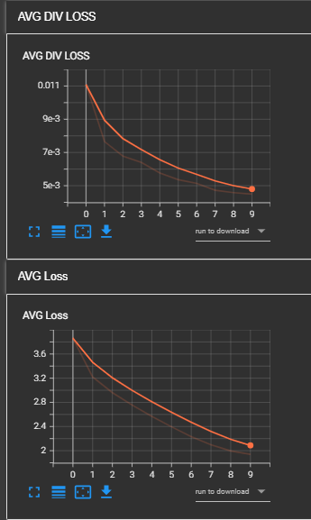

# 🖼️ MOE Image Captioning

A deep learning project for **Image Captioning** using a custom **Mixture of Experts (MOE) Transformer Decoder** combined with a **ResNet-50 image encoder**.

The model takes an image as input and generates a natural-language caption describing its content.

---

## 🚀 Project Overview

This project combines Computer Vision, Transformers, and Mixture of Experts into an image-captioning architecture.

The main components are:

- **ResNet-50** as the visual feature extractor.
- Custom **Multi-Head Attention (MHA)**.
- Custom **Transformer Decoder**.
- **Mixture of Experts (MOE)** for token processing.
- **Noisy Router** for dynamically selecting experts.
- **Cross-Attention** between text tokens and image features.
- **Diversity Loss** to encourage balanced expert utilization.
- **Gaussian Noise Augmentation** for both images and text embeddings.
- **BLEU-1 / BLEU-4** for evaluation.
- **Streamlit** interface for inference.

---

# Demo 


---

## 🧠 Model Architecture

```text
                    Input Image
                         │
                         ▼
                    ResNet-50
                         │
                    7 × 7 Features
                         │
                         ▼
                  Linear Projection
                         │
                         ▼
              Image Embeddings (49 tokens)
                         │
                         ▼
              Image Positional Embedding
                         │
                         │
                         ▼
              ┌─────────────────────┐
              │   MOE Transformer   │
              │      Decoder        │
              └─────────────────────┘
                         │
              ┌──────────┴──────────┐
              │                     │
              ▼                     ▼
       Self-Attention        Cross-Attention
              │                     │
              └──────────┬──────────┘
                         ▼
                    Noisy Router
                         │
             ┌───────────┼───────────┐
             ▼           ▼           ▼
          Expert 1    Expert 2    Expert 3
             │           │           │
             └───────────┼───────────┘
                         ▼
                  Shared Expert
                         │
                         ▼
                  Output Projection
                         │
                         ▼
                  Generated Caption
```

The decoder consists of **4 MOE Transformer layers**, with **3 experts** in each layer.

---

## 👁️ Image Encoder

The visual encoder is based on **ResNet-50 pretrained on ImageNet**.

The original average pooling and classification head are removed so that the model can preserve spatial visual information.

The resulting feature representation is:

```text
2048 × 7 × 7
```

This is reshaped into:

```text
49 × 2048
```

and then projected to the model embedding dimension:

```text
49 × 712
```

Therefore, the image is represented as **49 visual tokens**.

The model also adds a learned positional embedding for these 49 image tokens.

---

## 🤖 MOE Transformer Decoder

The decoder contains:

- Multi-Head Self-Attention
- Cross-Attention
- Noisy Router
- 3 Experts
- Shared Expert
- Layer Normalization
- Dropout
- Residual Connections

### Self-Attention

The decoder uses causal self-attention so that each generated token cannot attend to future tokens during training.

### Cross-Attention

Cross-attention allows the text representation to attend to the visual features produced by the ResNet-50 encoder.

This connects the generated caption with the image content.

---

## 🔀 Mixture of Experts

Instead of processing every token through the same feed-forward network, the model uses multiple experts.

For every token:

```text
Token
  │
  ▼
Noisy Router
  │
  ├──► Expert 1
  ├──► Expert 2
  └──► Expert 3
```

The router produces probabilities for the experts and the expert with the highest probability is selected for that token.

A **shared expert** is also applied to the input.

The final MOE output combines the selected expert output with the shared expert output.

---

## 🎯 Noisy Routing

The router contains a learnable noise mechanism.

During training, random Gaussian noise is added to the router logits:

```text
router logits + learned noise scale × Gaussian noise
```

This introduces randomness into expert selection and encourages exploration of different experts.

During evaluation, the router does not add random noise.

---

## ⚖️ Diversity Loss

A diversity loss is used to encourage the experts to be utilized more evenly.

The loss considers two aspects:

- **Importance:** how much probability mass each expert receives.
- **Load:** how many tokens are actually routed to each expert.

This helps reduce the possibility that the router sends most tokens to only one expert.

The final training loss includes the diversity loss:

```text
Total Loss =
Cross Entropy Loss
+ α × Diversity Loss
+ L1 Regularization
```

where the L1 term is optional.

---

## 🔊 Gaussian Noise Augmentation

Gaussian noise is used in **both the image and text parts of the model** during training.

### Image Noise

Random Gaussian noise can be added directly to the input image:

```text
Image + Gaussian Noise
```

The noise magnitude is randomly scaled during training.

### Text Embedding Noise

Gaussian noise is also randomly injected into the **text embeddings** inside the Transformer decoder.

```text
Text Embeddings
      +
Gaussian Noise
      ↓
Noisy Text Representation
```

The noise is applied randomly during training and is disabled during evaluation.

This provides an additional form of regularization and makes the model train with noisy representations.

---

## 📝 Text Processing

The captions are processed using **spaCy** tokenization.

The vocabulary contains the following special tokens:

```text
<PAD>
<SOS>
<EOS>
<UNK>
```

Captions are cleaned before tokenization by:

- Converting text to lowercase.
- Removing punctuation.
- Removing numbers.
- Removing non-alphabetic characters.
- Removing extra spaces.

---

## 🖼️ Data Augmentation

Training images use several augmentations:

- Resize
- Random Crop
- Random Horizontal Flip
- Random Rotation
- Random Perspective
- Color Jitter
- Normalization

Gaussian noise is additionally applied randomly during training.

---

## 📊 Training Configuration

| Parameter | Value |
|---|---:|
| Embedding Size | 712 |
| Hidden Size | 712 |
| Attention Heads | 8 |
| Head Dimension | 712 |
| Transformer Layers | 4 |
| Number of Experts | 3 |
| Expert Expansion Scale | 2 |
| Dropout | 0.2 |
| Optimizer | AdamW |
| Initial Learning Rate | `1e-4` |
| Weight Decay | `1e-3` |
| Epochs | 10 |
| Batch Size | 32 |
| Gradient Clipping | 1.0 |
| Label Smoothing | 0.05 |

---

## 🧮 Number of Parameters

The trained model contains:

**186,897,811 parameters**

Approximately:

**186.9M parameters**

---

## 📈 Results

The model was evaluated using BLEU scores.

| Metric | Score |
|---|---:|
| **BLEU-1** | **0.753** |
| **BLEU-4** | **0.397** |

### Interpretation

**BLEU-1 = 0.753**

The model achieves a relatively strong unigram overlap with the reference captions.

**BLEU-4 = 0.397**

BLEU-4 provides a stricter evaluation because it considers sequences of up to four consecutive tokens.

# 📸 Sample Outputs


## Example 1

--
## Example 2

--
## Example 3

--
## Example 4


---

## 📁 Project Structure

```text
.
├── assets/
│   ├── demo.png
│   ├── evaluation.png
│   ├── Figure_1.png
│   ├── Figure_2.png
│   ├── Figure_3.png
│   └── Figure_4.png
│
├── checkpoints/
│   └── ...
│
├── Data/
│   ├── Images/
│   └── captions.csv
│
├── Logs/
│   └── test42_with gaussian_noise/
│
├── model/
│   ├── components/
│   │   ├── utils/
│   │   │   ├── diversity_loss.py
│   │   │   └── transform.py
│   │   │
│   │   ├── mha.py
│   │   ├── moe_decoder.py
│   │   ├── moe.py
│   │   └── noisy_router.py
│   │
│   ├── dataset.py
│   ├── evaluation.py
│   ├── generation.py
│   ├── model.py
│   ├── moe_transformer.py
│   └── trainer.py
│
├── test_images/
│
├── .gitignore
├── app.py
├── readme.md
├── requirements.txt
├── test.py
├── train.ipynb
└── train.py
```

---

## 💾 Checkpoints

During training, the project automatically creates a `checkpoints` directory and saves checkpoints according to the configured saving interval.

For example:

```text
checkpoints/
├── checkpoint_0.pth
├── checkpoint_1.pth
├── ...
└── checkpoint_9.pth
```

### Important Note

If you don't find the `checkpoints` folder in the repository, this is most likely because the checkpoint files are **very large** due to the model's approximately **186.9M parameters**.

The trained checkpoints can be added to the repository in the future or provided separately.

The Streamlit application currently expects:

```text
checkpoints/checkpoint_9.pth
```

for inference.

---

## 🌐 Streamlit Application

The project includes a Streamlit interface for testing the trained model.

Run:

```bash
streamlit run app.py
```

Then:

1. Upload an image.
2. Click **Generate Caption**.
3. The model generates a caption for the image.

The application loads the trained checkpoint and performs autoregressive caption generation.

---

## ⚙️ Installation

Install the required Python packages:

```bash
pip install -r requirements.txt
```

Install the spaCy English tokenizer:

```bash
python -m spacy download en_core_web_sm
```

---

## 🏋️ Training

To train the model:

```bash
python train.py
```

The training process tracks:

- Training Loss
- Diversity Loss
- Gradient Norm
- Learning Rate
- BLEU-1
- BLEU-4

Training logs are stored in the `Logs/` directory.

---

## 📈 TensorBoard




--
### To visualize the training process:

```bash
tensorboard --logdir Logs
```

The project logs:

```text
LOSS PER BATCH
DIV LOSS PER BATCH
Gradient norm
Learning rate
AVG Loss
AVG DIV LOSS
BLEU-1
BLEU-4
```


---

## 🔬 Evaluation

The project includes a BLEU evaluation pipeline.

The evaluation process:

1. Generates a caption for an image.
2. Retrieves all reference captions associated with the image.
3. Cleans and tokenizes the captions.
4. Compares the generated caption with the reference captions.
5. Calculates BLEU-1 and BLEU-4.

The evaluation also avoids evaluating the same image multiple times when an image has multiple reference captions.

---

## 📝 Caption Generation

Caption generation is performed autoregressively.

The process starts with:

```text
<SOS>
```

Then the model predicts the next token:

```text
<SOS> → word₁ → word₂ → word₃ → ... → <EOS>
```

Generation stops when the model predicts:

```text
<EOS>
```

or the maximum generation length is reached.

---

## ✨ Main Features

- 🖼️ Image Captioning
- 👁️ ResNet-50 Visual Encoder
- 🤖 Custom Transformer Decoder
- 🔀 Mixture of Experts Architecture
- 🎯 Noisy Expert Routing
- 👀 Multi-Head Self-Attention
- 🔗 Cross-Attention
- ⚖️ Expert Diversity Loss
- 🔊 Gaussian Noise on Images
- 📝 Gaussian Noise on Text Embeddings
- 📊 BLEU-1 and BLEU-4 Evaluation
- 📈 TensorBoard Training Logs
- 🌐 Streamlit Inference Application
- 💾 Automatic Model Checkpointing
- 🧮 ~186.9M Trainable Parameters

---

## 🔮 Future Improvements

Possible future improvements include:

- Adding the trained checkpoints to the repository or hosting them separately.
- Training for more epochs.
- Experimenting with different numbers of experts.
- Improving the expert routing mechanism.
- Experimenting with different routing strategies.
- Adding beam search instead of greedy decoding.
- Testing stronger pretrained visual encoders.
- Evaluating with additional metrics such as CIDEr and METEOR.
- Optimizing the model's parameter count and inference speed.
- Performing more extensive hyperparameter tuning.

---

## 📌 Summary

This project implements an **Image Captioning system based on a custom MOE Transformer architecture**.

The system combines a pretrained **ResNet-50 encoder** with a **Mixture of Experts Transformer decoder**. The decoder uses noisy routing, shared and specialized experts, self-attention, cross-attention, and diversity loss.

An additional experimental component is the use of **Gaussian noise on both image inputs and text embeddings during training**.

The final trained model contains approximately **186.9M parameters** and achieved:

```text
BLEU-1 : 0.753
BLEU-4 : 0.397
```

The project also provides a Streamlit interface for using the trained model to generate captions from new images.


## 📜 License

This project is released under the MIT License.

---

## 🙌 Acknowledgments

Built to explore modern Vision-Language Models, Transformers, and Sparse Mixture of Experts architectures for Image Captioning.

---

##  👨🏻‍💻 Author

- **Ziad Abdel-Haliem Teama** 